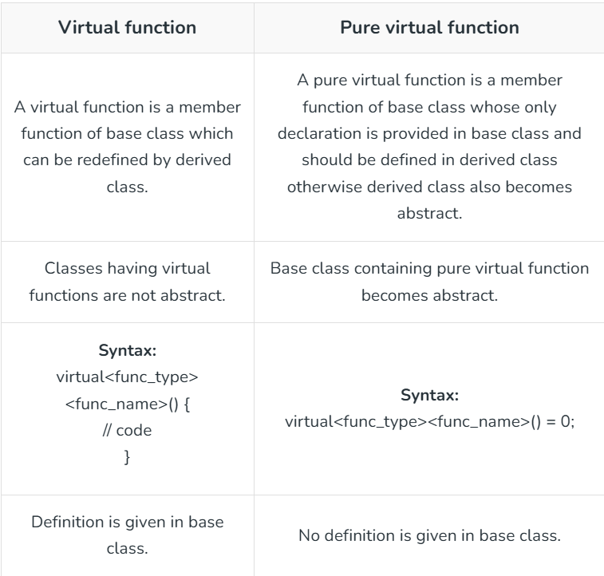

# Class

Class is a bluepint of real word entities
class is a userdefined datatype that group  data member and member function into a single unit

example: Animal

# Object

Object is an instance of class

example: Dog

# Access Modifiers

It control the visibility of class member(data and function)

### 1. private 

data and method are accessible inside a class

### 2. public

data and methods accessible to every one

### 3. protected 

data and method accessible inside class and to its derived class

Note: by default access modifier in c++ is private

# This Pointer

This is a special pointer in c++ that points the current object

``` this->prop ``` is same as ``` *(this).prop ```

# Constructor

Constructor is a special method which invoke automatically at time of object creation. is is used to initialization

#### properties 

#### 1. it have same name as class

#### 2. constructor doesn;t have a return type

#### 3. only called once (automatically), at object creation

#### 4. Memmory allocation happen when constructor is called

Constructor are of three type

### 1. Non parameterized constructor

This Constructor doesn't contain any parameter

### 2. Parameterized Constructor

This Constructor contain parameters

### 3. Copy constructor

it is a special type of constructor (default) used to copy properties of one object into another

this is always shallow copy

# Shallow copy

A shallow copy of an object copies all member values from one object to another

it have same memmory reference

# Deep copy

A deep copy not only copies the member values bit also make copies of any dynamic allocated memory that the member point to.

it have new memmory allocated

# Destructor

Destructor is a special member function of a class that is executed automatically when an object go out of scope or deleted. it main purpose is to release resource that object require during its life time 

destructor can only deallocated statically allocated memory data member or  memebr function

### Then how to delete the object which use heap memmory

use delete 

### what if we dont delete

it cause memmory leak

#### --> Memmory leak happen when program allocate memmory using heap but forget or fail to deallocate it

#### --> as a result

#### --> That memmory stay reserverd and cannnot reused by the program 

#### --> Overtime, this caise the program to consume more and more memmory, which can slow down or crash the system```

``` ~ClassName(){} ```


# OOPS Has 4 major pillars

### 1. Encapsulation

### 2. inheritance

### 3. Polymorphism

### 4. Abstraction

# Encapsulation

Encapsulation is wrapping of data and memebr function in a single unit called class

it help us in data hiding by using private access modifier

# Inheritance

When a properties & member function of base class are passed on to the derived class it is known as inheritance

it is used for code reusability

### Modes of inheritance


### Type of inheritance

#### 1. Single Inheritance

Single Inheritance means one base class and one derived class(derived class mean when that class inherit the properties and function of it base class)

#### 2. Multilevel Inheritance

Multilevel inheritance is a type of inheritance in c++ where class derived class inherit the properties of base class who also act like a base class for another class and like forming a chain of inheritance

#### 3. Multiple Inheritance

When a class is derived from more than one parent class it is called multiple inheritance

in Multiple inheritance Ambiguity occurs

##### Ambiguity is a state where compiler get confuse to choose which method who is present in more than one base class

##### How to handle 

it can me handled by scope resolution operator ```::```

```object.parentclassname::method```


#### 4. Hierarchial Inheritance

When more than one class inherit the property of same base class it is known as Hierarchial Inheritance

#### 5. Hybrid Inheritance

Hybrid inheritance is the combination of different type of inheritance

# Polymorphism

Polymorphism is the ability of object, function or operator to take on mutiple forms

example Constructor Overloading

### Types of polymorphism

#### 1. Compile time polymorphism

*CompileTime Polymorphism* which is also known as statuc binding is a type of polymorphism in which the method or function call is resolve at aompile time

##### Type of compiletime polymorphism

1. Function Overloading

Function overloading is an exmaple or implementation of compile time polymorphism. it is basically when we have more than one function present in a same class with same name or same return type but diff parameters.

2. Operator Overloading

Operator overloading in c++ is a feature that allow us to redefine the behaviour of existing operator like(+, -, *, /, ==)

syntax
``` classname operator operator_name (list)```

operator that cannnot be overloaded

``` ::, ., sizeof ``` and many more

#### 2. Run time polymorphism

it is also called dynamic binding. In run time polymorphism parent class and child class both contain the same function with different implementation. The parent class function is said to be overridden

##### type of run time pime polymorphism

1. function overriding

when a function with same name also present in deriend class it override the method/property of base class

2. virtual function

A virtual function is a member function that you expect to be redefined in derived class

##### Properties of virtual function

1. Virtual function is dynamic in nature

2. Define by the keyword "virtual" inside a base class and are always declared within the base class and overridden in a child class

*virtual keyword* The virtual keyword in C++ is used to tell the compiler that a function can be overridden in derived classes and should support runtime polymorphism

# Abstraction

Hiding the implementation and unnecessary detail and showing only functionality to user is known as abstraction

best way to implment it is access modifiers

Abstraction can done by Absract class

*Abstract class* 

An abstract class is a class in C++ that serves as a blueprint for other classes and cannot be instantiated. It contains at least one pure virtual function, enforcing derived classes to implement specific behavior.

    a class which contain pure virtual function automatically become abstract class

##### pure virtial function

A pure virtual function in C++ is a virtual function that does not have an implementation in the base class and must be overridden in derived classes.




# Static keyword

it can be used as

1. static Variables

Variable declared as astatic in a function are created and initialised once for the lifetime of the program. (in a function)


2. static Objects

Static variable in a class are created and initialized once. They are shard by all object of the class (in a class)

